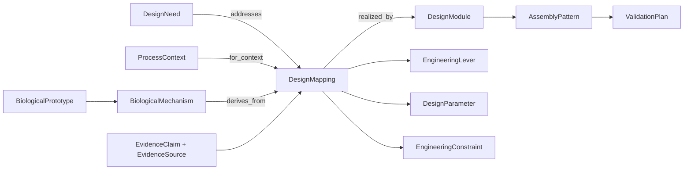

# 仿生反应器设计知识架构 v2

> 日期：2026-08-13
> 状态：已落地最小版本，待通过多条纵切片继续校准

## 1. 架构目标

本库要支撑的不是“找到一个有趣生物”，而是完成可追溯的设计推理：

```text
需求 → 生物机制 → 工程转译 → 设计模块 → 整机装配 → 运行控制 → 验证
```

最终输出可以是一种材料、一套微生物设计、一个反应器模块，也可以是由它们组成的完整仿生装备。任何输出都必须同时给出适用条件、排除约束、设计变量、证据和成熟度。

## 2. 四个消费者契约

| 消费者 | 典型输入 | 必要输出 | 主验证工具 |
|---|---|---|---|
| 材料设计 | 功能、污染物、工况、制造约束 | 组成/结构/表面/制备变量，性能目标，适用域 | DFT、MD、材料实验 |
| 微生物设计 | 目标反应、底物、电子受体、环境、稳定性要求 | 功能群、代谢路径、群落互作、空间组织、运行窗口 | 代谢模型、群落模型、培养实验 |
| 反应器/装备设计 | 工艺、负荷、目标、场地、成本、可改造性 | 模块组合、几何/拓扑、接口、控制点、参数、约束 | CFD、ASM、系统仿真、样机 |
| 运行优化 | 已确定的装备、传感信号、执行器、目标与安全边界 | 状态变量、控制策略、设定值/边界、退化路径 | 动态仿真、控制实验、实测 |

四个消费者共享本体，但不共享一个含糊的万能输入输出格式。查询时必须声明 `consumer`，避免材料问题被返回系统级空泛启示，或控制问题被返回不可操作的生物故事。

## 3. 统一模块，而非四座孤岛

`DesignModule` 用 `layer` 区分六个层级：

| 层级 | 主要内容 | 典型接口 |
|---|---|---|
| `material` | 组成、表面、孔隙、力学、制备 | 表面面积、亲疏水性、传质系数、生物相容性 |
| `microbial` | 功能群、代谢、互作、空间组织 | 底物/产物、电子供受体、SRT、抑制边界 |
| `component` | 填料、膜组件、曝气头、内构件、传感单元 | 几何、连接、压降、传质、维护 |
| `reactor` | 池型、区段、流场、反应与停留 | 进出流、回流、区段状态、执行器 |
| `system` | 多单元拓扑、回路、资源与能量集成 | 物流、能流、控制协调、旁路 |
| `control` | 观测、状态估计、策略、约束、执行 | 传感输入、设定值、执行命令、安全边界 |

整机由 `AssemblyPattern` 组合模块。装配记录必须至少跨两个模块层，并包含一个反应器模块。完整性不是“一定凑齐六层”，而是对该问题必要的层级都有定义，其他层明确不适用或待补。

## 4. 核心实体和职责

| 实体 | 回答的问题 |
|---|---|
| `DesignNeed` | 为哪个消费者解决什么设计任务？ |
| `ProcessContext` | 工艺、污染物、负荷和问题是什么？ |
| `TargetMetric` | 设计成功如何度量？ |
| `BiologicalPrototype` | 向哪个自然对象学习？ |
| `BiologicalMechanism` | 真正可迁移的因果机制是什么？ |
| `DesignMapping` | 该机制如何转译为工程设计？ |
| `DesignModule` | 可被复用、替换和装配的设计单元是什么？ |
| `AssemblyPattern` | 哪些模块如何组成一个装备候选？ |
| `EngineeringLever` | 工程上实际能改变什么？成本多大？ |
| `DesignParameter` | 哪些变量可以进入模型、优化器或控制器？ |
| `EngineeringConstraint` | 哪些条件一旦违反就必须排除候选？ |
| `EvidenceClaim` | 哪条证据具体支持哪项主张？ |
| `EvidenceSource` | 证据在哪里，如何定位？ |
| `ValidationPlan` | 如何证明或证伪这个候选？ |

## 5. 关系链与装配逻辑



图中箭头为了阅读做了简化，正式允许关系见 `knowledge/schema.json`。

装配时特别关注三类关系：

1. **组成关系**：整机包含哪些模块。
2. **兼容关系**：两个模块之间交换什么物质、能量、信号或约束。
3. **排除关系**：即使机制相似，候选也可能因为毒性、传质、剪切、制造、控制成熟度或改造成本而被淘汰。

## 6. 查询与排序原则

推荐查询流程：

1. LLM 把自然语言转换成消费者、情境、目标和硬约束。
2. 结构化过滤器先执行硬约束和适用域判断。
3. 沿“问题 → 映射 → 模块 → 装配”遍历候选。
4. 按以下因素排序：
   - 问题和工况匹配度；
   - 工程可操作性；
   - 模块接口完整度；
   - 证据质量；
   - 验证成熟度；
   - 改造成本与风险。
5. LLM 解释候选，并明确区分事实、推断和待验证假设。

当前工具实现精确属性过滤和关系组合，不实现语义向量排序。只有在积累足够同义词、查询日志和标注相关性后，才有理由加入嵌入检索或学习排序。

## 7. 数据和证据纪律

- ID 使用稳定的英文 `snake_case`，名称可以中英文演进，ID不随之改变。
- 同一事实只进入 `knowledge/graph.jsonl` 一次；矩阵和入口文件均由此生成。
- 原型、机制、工程映射分离，禁止把“观察到某种生物现象”直接写成“工程方案有效”。
- 参数必须带 `value_status`。未知就写 `unknown`，不得用示意值冒充边界。
- `verification_status` 只允许 `unverified / partially_verified / verified / rejected`。
- `verified` 必须有 `verified` 的证据声明；LLM生成内容默认 `unverified`。
- 失败仿真和否定实验同样进入库，状态标为 `rejected` 或证据声明标为 `refuted`，防止重复踩坑。

## 8. 当前 A²/O 样例的意义

A²/O 切片同时连接了：

- 设计需求：反应器设计、运行优化；
- 情境：低 C/N、进水波动、TN不稳定；
- 原型：微生物席；
- 机制：氧化还原分层和反应锋面迁移；
- 模块：微生物群落、串联分区反应器、控制器；
- 杠杆：曝气、内回流、碳源投加位置；
- 参数：锋面位置、厚度、迁移速度上限、响应时间；
- 约束：真实厌氧接触、硝化菌 SRT、硝酸盐回流边界；
- 验证：动态 ASM 对照、扫描和消融。

它验证了“微生物机制 → 反应器 → 控制”的链条，但尚未验证材料层，也尚未验证工程效果。因此下一批纵切片应有意补齐消费者契约，而不是继续复制同一种系统级案例。

## 9. 仍需继续讨论的架构问题

以下问题不应现在凭空定死，应通过真实切片决定：

1. **材料—微生物接口的最小字段**：生物相容性、附着、毒性、电子传递、传质和机械稳定性中，哪些必须成为硬字段？
2. **微生物设计的粒度**：以功能群、代谢模块、菌株、群落还是空间生态位为主要复用单元？不同场景可能需要不同粒度。
3. **整机完整度评分**：怎样衡量模块覆盖、接口完整性、证据成熟度和工程可实施性，而不把低证据方案打扮成高分？
4. **控制策略的数据结构**：等首条动态验证跑通后，再决定是否把观测量、状态估计、控制律、执行器和安全边界拆成独立实体。
5. **领域标签的角色**：13个领域更适合作为专家维护边界和查询标签，不宜作为互斥文件仓库；是否保留全部领域需由后续内容覆盖证明。
6. **何时引入数据库或向量检索**：文件方案在数百到数千实体内足够透明。只有查询延迟、并发、复杂路径或语义召回成为真实瓶颈时再迁移。

## 10. 演进顺序

建议用三条互补纵切片校准架构：

1. **现有 A²/O 切片**：验证微生物机制 → 反应器 → 控制。
2. **材料主导切片**：例如抗膜污染表面或高效传质填料，验证材料 → 组件 → 反应器接口。
3. **微生物主导切片**：例如低温硝化韧性或直接种间电子传递，验证功能群 → 群落 → 运行窗口。

三条切片都能被同一 schema 表达并通过真实查询后，再批量扩展领域和原型。若某条链不能表达，优先修改模型；若可以表达但内容无法验证，应停止扩展该方向，而不是继续增加条目数。
